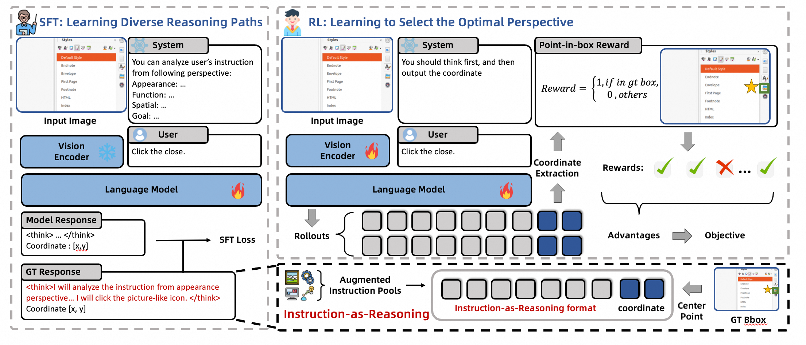

<div align="center">
<h1>Welcome to Tongyi-MiA!</h1>
  <h1>UI-Ins: Enhancing GUI Grounding with Multi-Perspective Instruction-as-Reasoning</h1> 
  
    
<div style="width: 100%; text-align: center; margin:auto;">
      
</div>

    
<div>
   <a href="https://arxiv.org/pdf/2510.20286"><strong>📑 Paper</strong></a>  | <a href="https://huggingface.co/Tongyi-MiA/UI-Ins-7B"><strong>🤗 UI-Ins-7B</strong></a> | <a href="https://huggingface.co/Tongyi-MiA/UI-Ins-32B"><strong>🤗 UI-Ins-32B</strong></a> |  <a href="https://www.modelscope.cn/models/Tongyi-MiA/UI-Ins-7B"><strong>🤖 UI-Ins-7B</strong></a> | <a href="https://www.modelscope.cn/models/Tongyi-MiA/UI-Ins-32B"><strong>🤖 UI-Ins-32B</strong></a>
   </div>   
</div>

GUI grounding, which maps natural-language instructions to actionable UI elements, is a core capability of GUI agents. Prior works largely treats instructions as a static proxy for user intent, overlooking the impact of instruction diversity and quality on grounding performance. Through a careful investigation of existing grounding datasets, we find a **23.3%** flaw rate in their instructions and show that inference-time exploitation of instruction diversity yields up to a substantial **76%** relative performance improvement.

In this paper, we introduce the **Instruction-as-Reasoning paradigm**, treating instructions as dynamic analytical pathways that offer distinct perspectives and enabling the model to select the most effective pathway during reasoning. To achieve this, we propose a two-stage training framework: supervised fine-tuning (SFT) on synthesized, diverse instructions to instill multi-perspective reasoning, followed by reinforcement learning (RL) to optimize pathway selection and composition.

Our resulting models, UI-Ins-7B and UI-Ins-32B, achieve state-of-the-art results on five challenging grounding benchmarks and exhibit emergent reasoning, selectively composing and synthesizing novel instruction pathways at inference. In particular, UI-Ins-32B attains the best grounding accuracy, scoring **87.3%** on UI-I2E-Bench, **57.0%** on ScreenSpot-Pro, and **84.9%** on MMBench-GUI L2. Furthermore, our model demonstrates strong agentic potential, achieving a **74.1%** success rate on AndroidWorld using UI-Ins-7B as the executor. Our in-depth analysis reveals additional insights such as how reasoning can be formulated to enhance rather than hinder grounding performance, and how our method mitigates policy collapse in the SFT+RL framework. 

## 📰 News

- [Oct, 24 2025] Release the UI-Ins models, data processing code, training code and evaluation code.

## 🔧 Setup

- Setup the SFT environment by followiing instructions [here](https://github.com/hiyouga/LLaMA-Factory)
- Setup the RL environment by following instructions [here](https://github.com/volcengine/verl?tab=readme-ov-file)

## Data Processing Pipeline

We provide a high-quality data processing pipeline detail in [here](https://github.com/alibaba/UI-Ins/data_pipeline).

## Training

We provide the [SFT](https://github.com/alibaba/UI-Ins/SFT) and [RL](https://github.com/alibaba/UI-Ins/RL) code of UI-Ins.

## Evaluation

We provide the evaluation code detail in [here](https://github.com/alibaba/UI-Ins/evaluation)

## ⚡️ Quick Use

You can inference UI-Ins simply by the following script:
<pre>
import torch
import re
from PIL import Image
from transformers import AutoProcessor, Qwen2_5_VLForConditionalGeneration

MODEL_PATH = "Qwen/Qwen2.5-VL-7B-Instruct"  
IMAGE_PATH = "path/to/your/image.jpg"  
INSTRUCTION = "Click the 'Search' button"

def parse_coordinates(raw_string: str) -> tuple[int, int]:
    matches = re.findall(r'\[(\d+),\s*(\d+)\]', raw_string)
    if matches:
        return tuple(map(int, matches[0]))
    return -1, -1

print("Loading model...")
model = Qwen2_5_VLForConditionalGeneration.from_pretrained(
    MODEL_PATH,
    torch_dtype=torch.bfloat16,
    device_map="auto"
).eval()
processor = AutoProcessor.from_pretrained(MODEL_PATH)

image = Image.open(IMAGE_PATH).convert("RGB")
messages = [
    {
        "role":"system",
        "content": [
            {
                "type": "text",
                "text": "You are a helpful assistant."
            },
            {
                "type": "text",
                "text": """You are a GUI agent. You are given a task and your action history, with screenshots. You need to perform the next action to complete the task.\n\n## Output Format\nReturn a json object with a reasoning process in <think></think> tags, a function name and arguments within <tool_call></tool_call> XML tags:\n```\n<think>\n...\n</think>\n<tool_call>\n{"name": "grounding", "arguments": <args-json-object>}\n</tool_call>\n```\n<args-json-object> represents the following item of the action space:\n## Action Space{"action": "click", "coordinate": [x, y]}\nYour task is to accurately locate a UI element based on the instruction. You should first analyze instruction in <think></think> tags and finally output the function in <tool_call></tool_call> tags.\n"""
                }
            ]
    },
    {
    "role": "user",
    "content": [
        {"type": "image"},
        {"type": "text", "text": INSTRUCTION}
    ]
}]

prompt = processor.apply_chat_template(messages, tokenize=False, add_generation_prompt=True)
inputs = processor(text=[prompt], images=[image], return_tensors="pt").to(model.device)

print("Running inference...")
generated_ids = model.generate(**inputs, max_new_tokens=128)
response_ids = generated_ids[0, len(inputs["input_ids"][0]):]
raw_response = processor.decode(response_ids, skip_special_tokens=True)

point_x, point_y = parse_coordinates(raw_response)

print("\n" + "="*20 + " RESULT " + "="*20)
print(f"Instruction: {INSTRUCTION}")
print(f"Raw Response: {raw_response}")

if point_x != -1:
    _, _, resized_height, resized_width = inputs['pixel_values'].shape
    norm_x = point_x / resized_width
    norm_y = point_y / resized_height
    
    print(f"✅ Parsed Point (on resized image): ({point_x}, {point_y})")
    print(f"✅ Normalized Point (0.0 to 1.0): ({norm_x:.4f}, {norm_y:.4f})")
else:
    print("❌ Could not parse coordinates from the response.")
print("="*48)
</pre>

## 📮 Contact

Fell free to contact `liangyuchen@ruc.edu.cn` if you have any questions.

## License

This repo follows CC-BY-NC-SA 4.0 license. Please use this repo for non-commercial use ONLY.

## Citation
If you use this repository or find it helpful in your research, please cite it as follows:
```bibtex
@misc{chen2025uiinsenhancingguigrounding,
      title={UI-Ins: Enhancing GUI Grounding with Multi-Perspective Instruction-as-Reasoning}, 
      author={Liangyu Chen and Hanzhang Zhou and Chenglin Cai and Jianan Zhang and Panrong Tong and Quyu Kong and Xu Zhang and Chen Liu and Yuqi Liu and Wenxuan Wang and Yue Wang and Qin Jin and Steven Hoi},
      year={2025},
      eprint={2510.20286},
      archivePrefix={arXiv},
      primaryClass={cs.CV},
      url={https://arxiv.org/abs/2510.20286}, 
}
```

