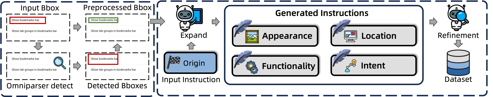

# Instruction Diversity augmentation and quality refinement

      

## Diversity Augmentation

You should use a openai format to generate diverse instructions via prompt_agument.txt, it is noticeable we use a red rectangle marker for the bbox ground truth (e.g. OS-Altas) and a red circle marker for the point ground truth (e.g. AgentNet).

## Quality Refinement

You can use prompt_refinement.txt to filter the low-quality instructions (including origin instruction and augmented instructions), we filter these low-quality instructions by the visual correspondence.